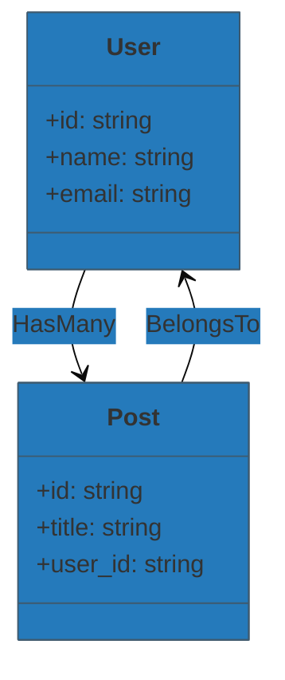

# LaraCare Schema Visualizr

<strong>LaraCare Schema Visualizr</strong> is an intelligent Laravel package that automatically generates <strong>UML/Class</strong> Diagrams from your Eloquent Models and Database Migrations, providing a clear and dynamic visualization of your application’s architecture.

It helps developers, architects, and researchers instantly understand model attributes, relationships, and schema structure, all rendered in Mermaid.js format.

# Features

- **Automatic Model Discovery:** Scans all your Laravel model classes and extracts their structure via reflection.
- **Migration Intelligence:** Parses migration files to infer table names, columns, and foreign key relationships.
- **Relationship Detection:** Identifies `hasOne`, `hasMany`, `belongsTo`, and `belongsToMany` relationships using runtime analysis.
- **Unified Schema Understanding:** Combines information from both models and migrations for complete schema accuracy.
- **Visual Representation:** Outputs diagrams in Mermaid Class Diagram syntax, compatible with Markdown, Docs, and LiveView rendering.
- **Safe & Extensible Architecture:** Built with modular parsers (ModelParser, MigrationParser) for easy extension and maintenance.


# 📦 Installation

```bash
composer require laracare/schema-visualizr --dev
```

## Publish the configuration

```bash
php artisan vendor:publish --provider="LaraCare\SchemaVisualizr\SchemaVisualizrProvider"
```

# 🧠 How It Works
The package works in three main stages:
| Stage                 | Description                                                                                              |
| --------------------- | -------------------------------------------------------------------------------------------------------- |
| **Model Analysis**    | Reflects on your Laravel models to extract class names, fillable attributes, and Eloquent relationships. |
| **Migration Parsing** | Reads migration files to capture column definitions and foreign key constraints.                         |
| **UML Generation**    | Combines both layers of information into a rich Mermaid diagram syntax for rendering.                    |

# 🧱 Core Components
### 1️⃣ Diagram Service

This is the central service that generates the final UML.

Location:
`src/Services/Diagram.php`

Responsibilities:

- Load and analyze model classes.

- Parse migration files.

- Detect relationships.

- Generate Mermaid UML syntax.

* Example:
```php
use LaraCare\SchemaVisualizr\Services\Diagram;
use LaraCare\SchemaVisualizr\Parsers\ModelParser;

$diagram = new Diagram(new ModelParser());
$uml = $diagram->generate();

echo $uml;
```
Output Example:


# 🧑‍💻 Author

Jery FOTO
AI/ML & IoT Developer | Laravel Backend Engineer
📧 [jery@example.com
]
🌐 https://jery-portal.vercel.app

# ⭐ Contribute

Pull requests are welcome!
If you have new ideas for schema visualization or AI-assisted architecture diagrams, open an issue or PR.

# 💬 Feedback & Support

Your feedback helps this package evolve intelligently.

- 🧩 Contributions: Fork, improve, and send a PR — every contribution counts.

- 📧 Direct Contact: jeryfoto.dev@gmail.com
 (for professional collaboration)
